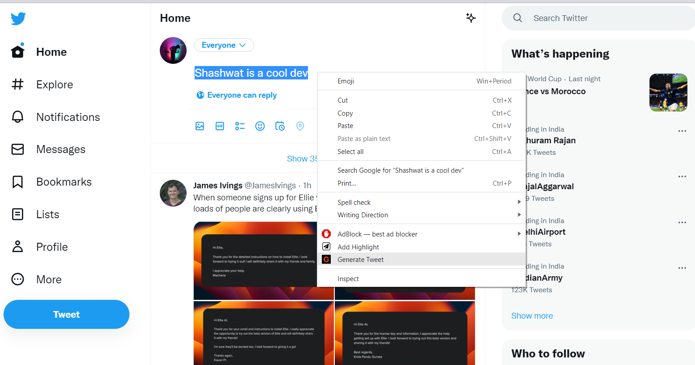

To use my extension, download the repository zip and then [Load Unpacked Extension](https://www.instructables.com/How-to-Load-Unpacked-Extension-in-Chrome-Easy/)

Add your openAI API key [Get it from here](https://beta.openai.com/account/api-keys)

After adding key, just start typing your tweet's topic in twitter, highlight it, right click and select generate tweet.

PS: The extension is a working in progress. Checkout the [Web App](https://ai-tweeter.up.railway.app/)